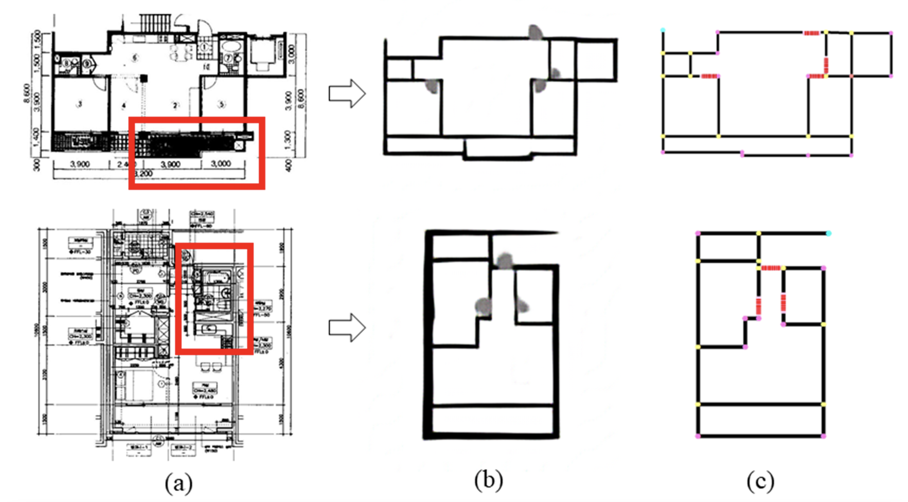
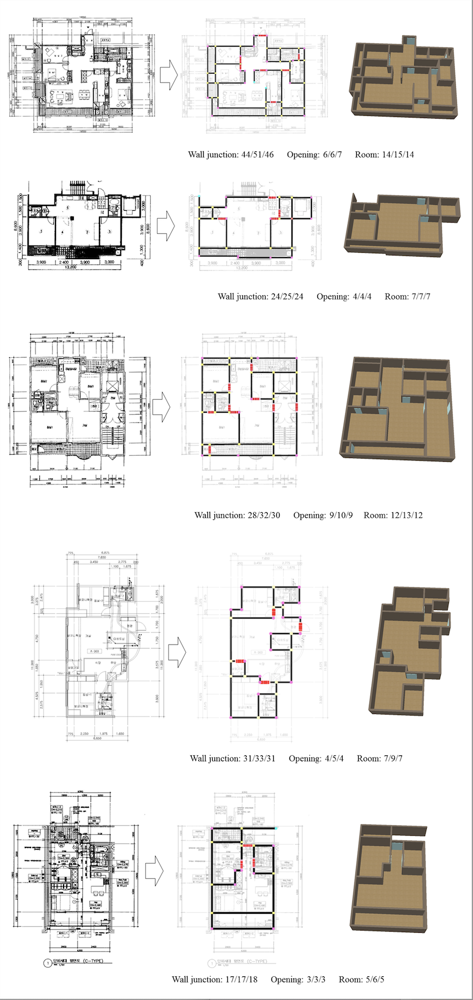

## **Deep Floor Plan Analysis for Complicated Drawings Based on Style Transfer**  
[Seongyong Kim](http://syoi92.github.io), Seula Park, Hyengjung Kim, Kiyun Yu  
Journal of Computing in Civil Engineering, 2021.


This *FPNet* [[Source](https://www.dropbox.com/sh/fosnic9d0b1ta1m/AADBhGZbPoIuBovZpF4bEaefa?dl=0)] is able to reconstruct walls in areas with overlapping graphics or nonuniform patterns, thus allowing the room structures to be recovered even from complicated drawings.

<figure class="image">
    
    <figcaption><sub>Fig. (a) input floor plan images and our results of (b) the style-transferred plans and (c) the vectorized floor plans</sub></figcaption>
</figure>
<br/>


#### Citation
```
@article{FPNet2020, 
    title={Deep Floor Plan Analysis for Complicated Drawings Based on StyleTransfer}, 
    author={Seongyong Kim, Seula Park, Hyeongjung Kim, Kiyun Yu}, 
    journal={Journal of Computing in Civil Engineering}, 
    year={2020}, 
    DOI={10.1061/(ASCE)CP.1943-5487.0000942}
}
```
<br/>


#### **Acknowledgments**
Code borrows heavily from [[Isola *et al*](https://github.com/phillipi/pix2pix)]. The floor plan datasets originated from *EAIS-fp* [[Jang *et al*](https://)] and *SNU-fp* [[Kim *et al*](https://)], and in purpose of increasing the varsarity of the datasets, we added more drawings in diverse formats.

***
<br/>

<details open>
<summary> DEMO- underworking</summary>  

#### How to run this demo
The demo requires Python =< 3.6 (The version of TensorFlow we specify in*requirements.txt* is not supported in Python 3.7+).  

```
git clone https://github.com/streamlit/demo-face-gan.git
cd demo-fpnet
pip install -r requirements.txt
streamlit run app.py
```
</details>
<br/>


#### **supplementary**
<figure class="image">
    
    <figcaption><sub>Fig. Results of our method for various types of complex floor plans in EAIS. (a–c) An input floor plan, our vectorized floor plan, and
the corresponding 3D model. In the vectorized floor plan, the walls and openings are represented by lines, respectively.</sub></figcaption>
</figure>
